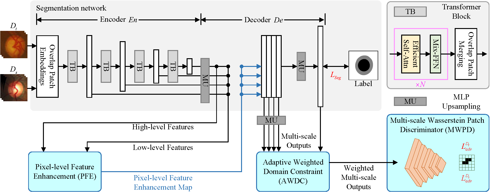

# :page_facing_up: Unsupervised Domain Adaptation Fundus Image Segmentation via Multi-scale Adaptive Adversarial Learning

<p align="center"></p>

### Dependency Preparation

```shell
cd MAAL
# Python Preparation
conda create -n UDA_MAAL python=3.8.5
activate UDA_MAAL
# (torch 1.7.1+cu110) It is recommended to use the conda installation on the Pytorch website https://pytorch.org/
conda install pytorch==1.7.1 torchvision==0.8.2 torchaudio==0.7.2 cudatoolkit=11.0 -c pytorch
pip install -r requirements.txt
```

### Model Training and Inference


- 1. Download the dataset and modify the relevant paths in the configuration file (./configs/).
- 2. Download the Segformer pre-trained model ([segformer_b5_backbone_weights.pth](https://github.com/bubbliiiing/segformer-pytorch)) and put it in the ./model_data folder. 
- 3. Model Train
```shell
python Train.py
```
- 4. Model Evaluation
```shell
python eval.py
```

### Citation ✏️ 📄

If you find this repo useful for your research, please consider citing the paper as follows:

```
@article{zhou2023unsupervised,
  title={Unsupervised Domain Adaptation Fundus Image Segmentation via Multi-scale Adaptive Adversarial Learning},
  author={Zhou, Wei and Ji, Jianhang and Cui, Wei and Wang, Yingyuan and Yi, Yugen},
  journal={IEEE Journal of Biomedical and Health Informatics},
  year={2023},
  publisher={IEEE}
}
```

### Acknowlegement
Part of the code is based on [LoveDA](https://github.com/Junjue-Wang/LoveDA), [segformer](https://github.com/bubbliiiing/segformer-pytorch), etc.